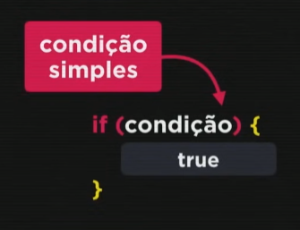

# Condiçoes

há tres condições presentes na linguagem, são elas: condição simples, condição composta, condiçoes aninhadas e Condição múltipla.\

### Condição Simples

quando temos apenas um if:

<figure><figcaption></figcaption></figure>

### Condição Composta

quando temos o if e o else:

<figure><figcaption></figcaption></figure>

### Condições aninhadas

quando fazemos a utilização do else if:\
.png>)

### Condição Múltipla

quando utilizamos o switch

<figure><figcaption></figcaption></figure>

